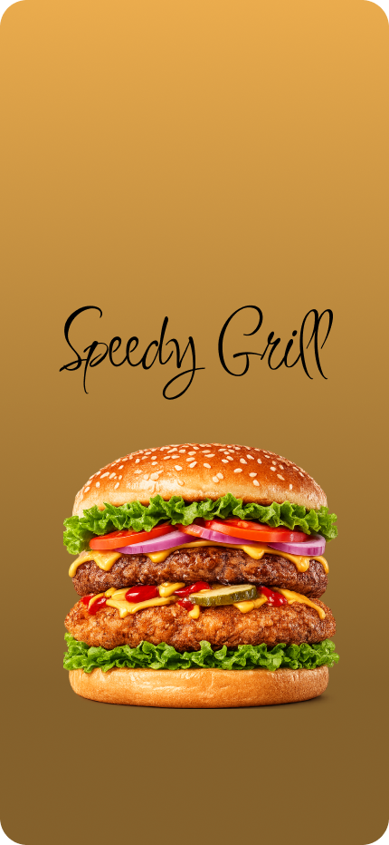
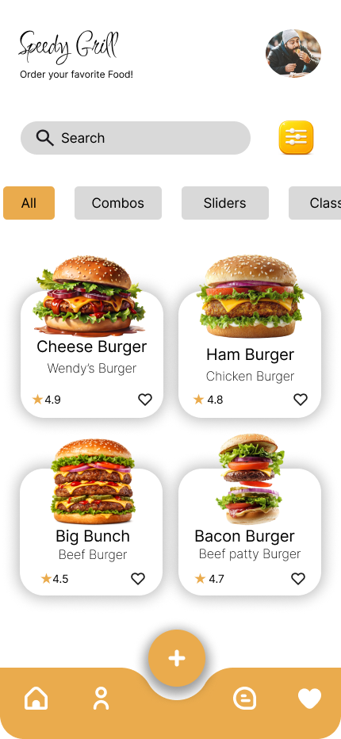
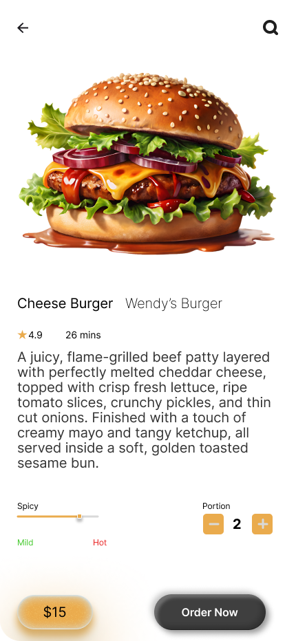
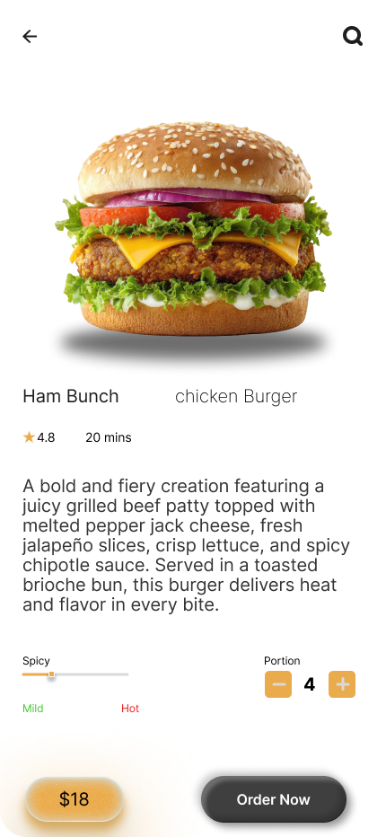
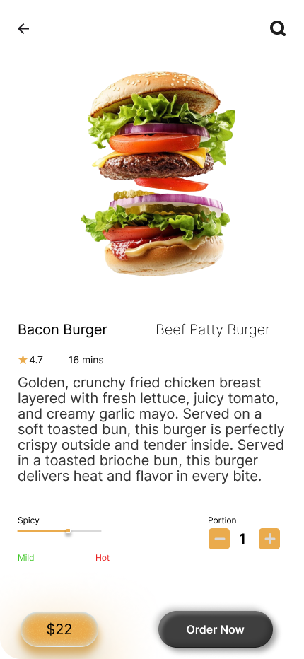
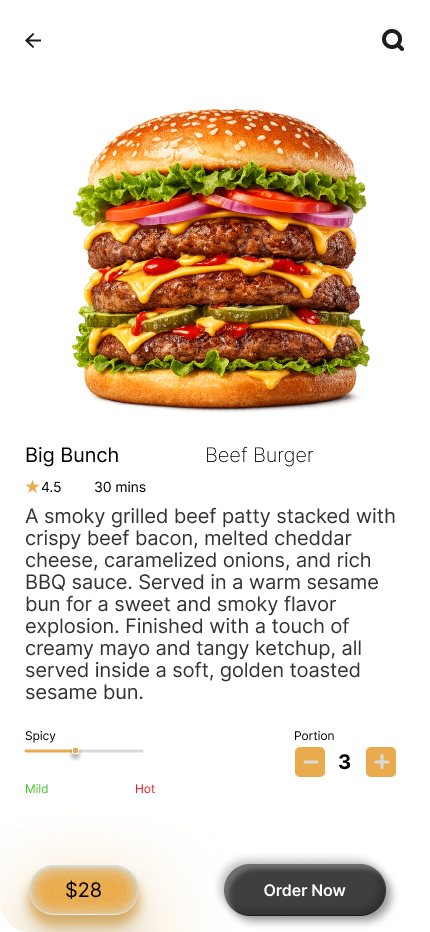
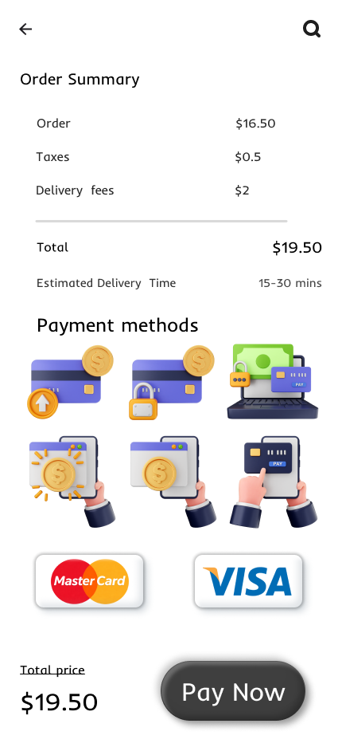
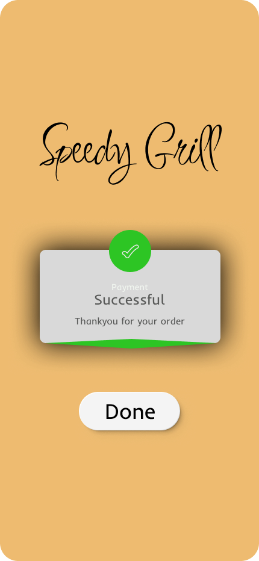

# 🍔 Speedy Grill – Food Ordering Mobile App UI

Modern **food ordering mobile app UI/UX design** focused on a clean interface, smooth navigation, and attractive food visuals.  
This project demonstrates a complete burger ordering experience from browsing the menu to placing an order.

---

## 📸 UI Preview

  
  

  
  

  
  

  
  

  
  

  
  

---

## ✨ Features

- 🍔 Burger menu browsing
- 🎨 Modern and clean UI design
- ⚙️ Food customization options
- 💳 Order summary and payment screen
- 💬 Customer support chat interface
- 👤 User profile management

---

## 📱 Screens Included

- Splash Screen  
- Home Screen  
- Burger Details  
- Customization Screen  
- Order Summary  
- Payment Screen  
- Order Success Screen  
- Chat Support  
- User Profile  

---

## 🛠 Tools Used

- Figma  
- UI/UX Design Principles  
- Mobile Interface Design  

---

## 📌 Project Purpose

This project was created to practice and showcase **mobile UI/UX design skills** by designing a modern food ordering application interface.

---

⭐ If you like this project, feel free to star the repository.
